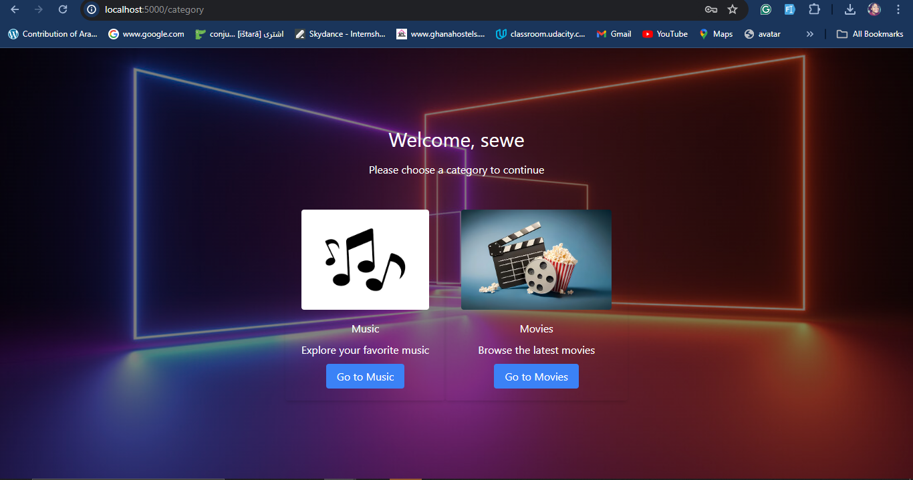
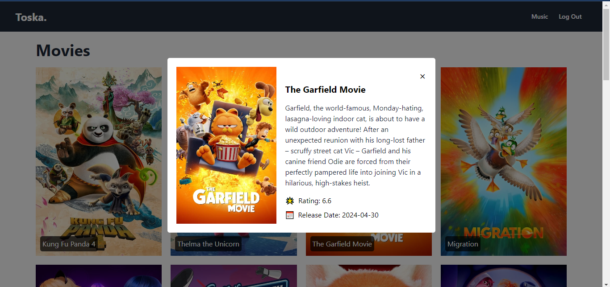
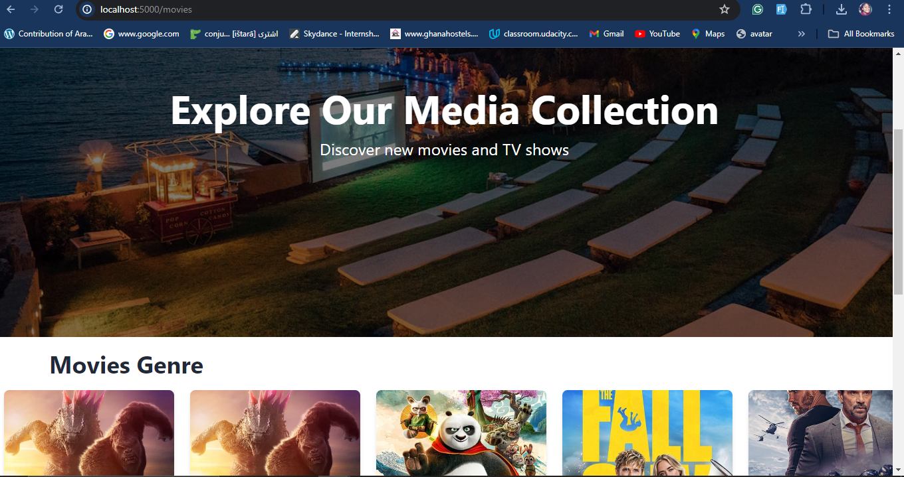
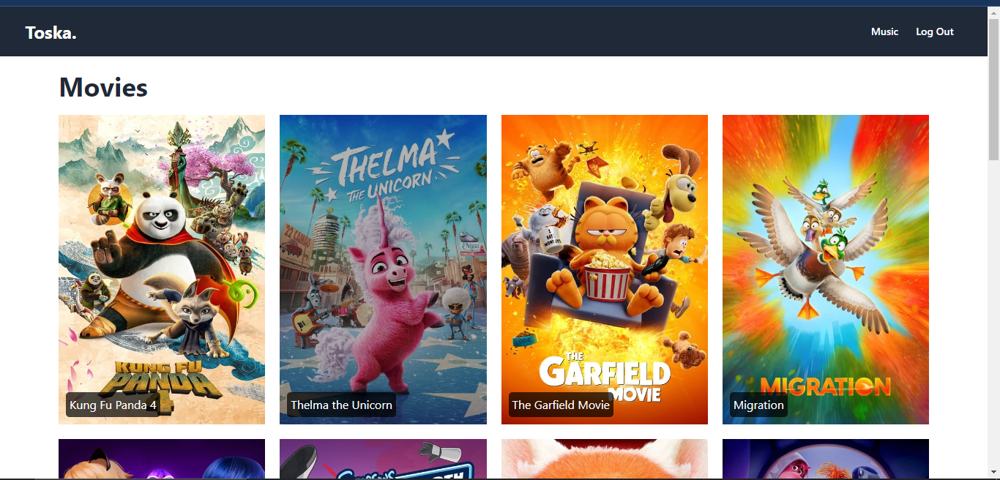
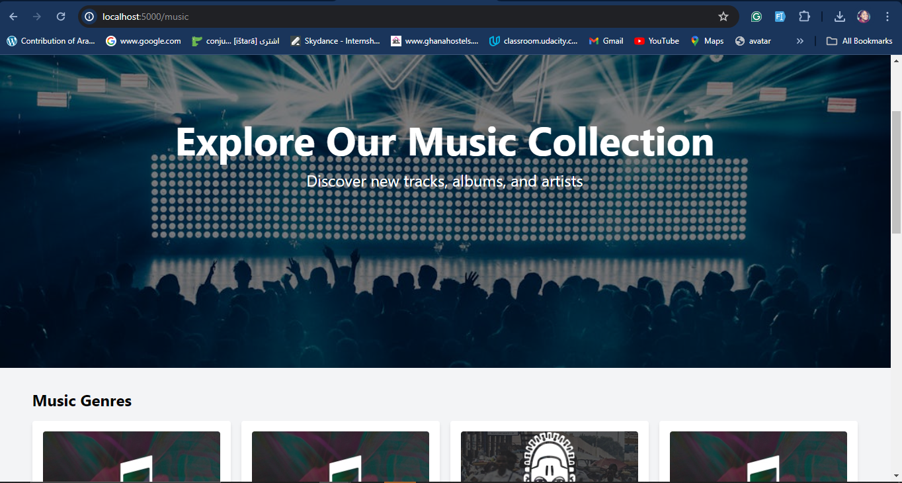

<h1 align="center" id="title">ToskA.</h1>

<p id="description">ToskA is web application to explore the latest trends in music and movies from around the world with the ability to discover top trending songs by genre and hottest movies worldwide. Toska provides a seamless experience for entertainment enthusiasts everywhere. Stay in tune with the pulse of global culture with ToskA.</p>

<h2>🚀 Demo</h2>

[https://drive.google.com/file/d/1myImbBD7jaA9Z\_LUImHLmyJxiSV7UPvH/view?usp=drive\_link](https://drive.google.com/file/d/1myImbBD7jaA9Z_LUImHLmyJxiSV7UPvH/view?usp=drive_link)

<h2>Project Screenshots:</h2>












  
  
<h2>🧐 Features</h2>

Here're some of the project's best features:

*   CATEGORIES
*   Music Genre
*   Movies Genre
*   Music Preview
*   Movies Preview

<h2>🛠️ Installation Steps:</h2>

<p>1. Cloning Repository</p>

```
Tap on "Code" on the Repository
```

```
copy either an http link or ssh link
```

```
Then git clone "repo link" on local machine 
```

```
Run Npm install
```

```
npm run init
```

```
Create .env
```

```
npm run dev
```

```
Open your web browser and go to http://localhost:3000 to see the application in action
```
<h2>💻 Built with</h2>

Technologies used in the project:

*   NodeJs(>=14.x.x)
*   Ejs
*   Express
*   MongoDB (>=4.x.x)
*   Tailwind
*   Npm (>=6.x.x)

<h2>CONTRIBUTERS</h2>

<h4>Jessica Sewe Guriyire</h4> 
https://github.com/jessicasewe

https://www.linkedin.com/in/jessica-guriyire-977b2618a/
